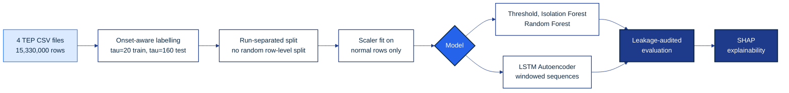

<div align="center">


<br/>

[](https://www.python.org/)
[](#license)
[](#data)
[](#headline-results)
[](#headline-results)

**Comparative evaluation of machine learning anomaly detection against a conventional
threshold-based DCS alarm, on the complete Tennessee Eastman Process (TEP) benchmark,
with SHAP-based explainability for alarm rationalisation.**

MSc AI final project — Maryam Ali (202509001), Bahrain Polytechnic, 2026
Full write-up: [`202509001_Thesis_FINAL.docx`](#) · this repository is its code companion (cited in Appendix A)

</div>

<br/>

## Contents

- [Research questions](#research-questions)
- [Headline results](#headline-results)
- [Pipeline](#pipeline)
- [Repository structure](#repository-structure)
- [Setup](#setup)
- [Data](#data)
- [Reproducing the results](#reproducing-the-results)
- [Models and key hyperparameters](#models-and-key-hyperparameters)
- [Explainability](#explainability)
- [Citation](#citation)
- [License](#license)

<br/>

## Research questions

| | |
|---|---|
| **RQ1** | To what extent can machine learning models detect process anomalies more accurately, and earlier, than a conventional threshold-based alarm? |
| **RQ2** | Which of Isolation Forest, Random Forest, and an LSTM Autoencoder achieves the best trade-off between detection accuracy and false-alarm rate on TEP? |
| **RQ3** | How can SHAP-based explainability identify which process variables drive a detected anomaly, in a way that supports engineer decision-making? |

<br/>

## Headline results

Full leakage-audited protocol · complete dataset (15,330,000 rows, no subsampling) · matched false-alarm budgets · Wilcoxon signed-rank significance testing across all 20 fault classes. Full detail in **Chapter 5** of the thesis.

| Model | F1 | ROC-AUC | Det. @ 1% FAR | FAR |
|---|---:|---:|---:|---:|
| Threshold (3σ) | 0.478 | 0.720 | 31.6% | 0.96% |
| Isolation Forest | 0.747 | 0.864 | 46.0% | 5.56% |
| **Random Forest** | **0.864** | **0.919** | **71.1%** | 2.89% |
| LSTM Autoencoder | 0.795 | 0.859 | 62.2% | 4.37% |

> Random Forest's improvement over the threshold baseline is statistically significant (p < 0.0001, Wilcoxon signed-rank, n = 20 fault classes). This demonstrates substantially better detection **at equal false-alarm cost** — it is not a claim that the model detects faults earlier in absolute time; detection latency was only measured for Random Forest itself, not benchmarked against the threshold alarm's own response time.

<br/>

## Pipeline



<br/>

## Repository structure

```
anomaly-detection/
├── README.md                      <- you are here
├── banner.svg                     <- README header graphic
├── requirements.txt                <- pinned Python dependencies
├── LICENSE
├── TEP_Thesis_Analysis_v5.ipynb    <- full analysis notebook, run top to bottom
├── config.py                       <- central hyperparameter / path configuration
├── data/                           <- NOT included, see Data section below
├── results/
│   ├── tables/                     <- CSV exports of every results table (5.1-5.9)
│   └── figures/                    <- PNG exports of every thesis figure
└── models/                         <- saved model artifacts (optional)
```

<br/>

## Setup

```bash
git clone https://github.com/m-mudaffar/anomaly-detection.git
cd anomaly-detection
python3 -m venv venv
source venv/bin/activate        # Windows: venv\Scripts\activate
pip install -r requirements.txt
jupyter notebook TEP_Thesis_Analysis_v5.ipynb
```

> Developed and tested on **Python 3.13, CPU only** — no GPU or cloud acceleration required. Total training time across all three learned models is approximately **0.31 CPU-hours (739 seconds)** on a consumer laptop.

<br/>

## Data

The TEP dataset is generated by Rieth et al. (2017) and hosted on Harvard Dataverse under a **CC0 1.0 (public domain)** licence — free to download, no registration required.

| | |
|---|---|
| **Source** | https://doi.org/10.7910/DVN/6C3JR1 |
| **Files needed** | `TEP_FaultFree_Training.csv`, `TEP_Faulty_Training.csv`, `TEP_FaultFree_Testing.csv`, `TEP_Faulty_Testing.csv` |
| **Not included** | The four files total 15,330,000 rows and exceed GitHub's per-file size limits. Download them from the link above and place them in a local `data/` folder before running the notebook. |

<br/>

## Reproducing the results

- Global random seed **42** (NumPy and TensorFlow) throughout.
- Training/testing partitions are the dataset's own independent simulation runs — **never** a random row-level split — to avoid temporal leakage between autocorrelated samples.
- The notebook opens with a methodological-safeguards summary and closes with a table mapping each research question to the exact cell and results file that answers it.
- A dedicated leakage-audit cell hashes all ~15 million feature rows and confirms **zero overlap** between the training and testing partitions before any model is scored.

<br/>

## Models and key hyperparameters

| Model | Key settings |
|---|---|
| Static threshold | `\|z\| > 3.0`, fitted on normal training rows only |
| Isolation Forest | `n_estimators=300, max_samples=50_000, random_state=42`, alarm threshold = 95th percentile of normal-data anomaly scores |
| Random Forest | `n_estimators=100, max_depth=20, min_samples_leaf=5, class_weight="balanced", random_state=42` |
| LSTM Autoencoder | LSTM(64) → RepeatVector → LSTM(64) → TimeDistributed(Dense), 10-sample (30-min) window, Adam/MSE, batch size 256, `random_state=42` |

Full hyperparameter tables: **Appendix C** of the thesis.

<br/>

## Explainability

SHAP (`TreeExplainer`) is applied to the trained Random Forest to produce a per-fault-class map of distinctive driver variables, intended to support DCS alarm rationalisation — see **Chapter 5.2** and **Chapter 6** of the thesis for the full discussion.

<br/>

## Citation

If referencing this work:

```
M. Ali, "Comparative Machine Learning Anomaly Detection and SHAP-Based Alarm
Rationalisation for Distributed Control Systems," MSc AI Final Project,
Bahrain Polytechnic, 2026. https://github.com/m-mudaffar/anomaly-detection
```

<br/>

## License

Code in this repository is released under the **MIT License** (see [`LICENSE`](LICENSE)). The TEP dataset itself is separately licensed **CC0 1.0** by its original authors (Rieth et al., 2017) — see the [Data](#data) section above.

<br/>

<div align="center">

**Maryam Ali** — DCS Engineer, Yokogawa — 202509001@student.polytechnic.bh

</div>
